# Unit 15

[[toc]]

## Assignment 2

## Website

[Hot Beans Web](https://430058hotbeansweb.netlify.app/)

## To Do List

+ Create Client Requirements 01/02/2024
+ Create story boards 02/02/2024-05/02/2024
+ Create website 06/02/2024-12/02/2024
+ Usability testing 13/02/2024
+ Functionality Testing 13/02/24
+ Respond to testing 13/02/16--16/02/24
+ Optimisations  17/02/2024
+ Evaluation 18/02/24
+ Check through 19/02/24 - 28/02/2024
+ Deadline 28/02/2024

## Requirements

### Client Requirements

+ Have a company profile
+ Have profiles of existing trainee web developers
+ Job specifications and required qualifications
+ An online application form
+ Have links to web development courses

### User Requirements

+ A website that is accessible
+ A website that is easy to use and understand
+ A website that is easy to navigate
+ A website that is responsive
+ A website that loads within a couple seconds

### Developer requirements

+ Code needs to be easy to understand
+ Code needs to be easy to maintain

## Design

### Target Audience

People who have completed training courses or qualifications related to web development and are now looking for a job as a web developer.

### Colour Scheme

[Paletton](https://paletton.com/#uid=13q0u0kh5hca9roeDmlmgeJriag)

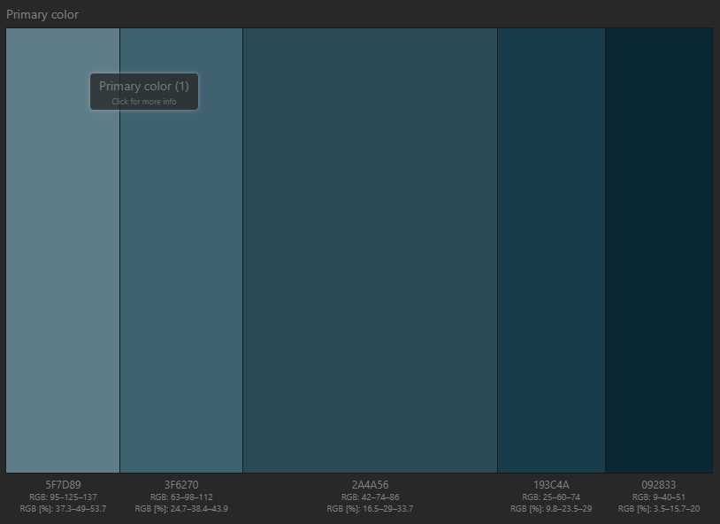

+ #2A4A56
+ #5F7D89
+ #3F6270
+ #193C4A
+ #092833

This color scheme provides good contrast against light backgrounds, making text and interactive elements easily readable for users with visual impairments, and it is visually distinct, helping users easily distinguish different sections or elements on the website.

### Typography

I will be using Arial, Helvetica, sans-serif in that order of priority. I will be using Arial because it is easy to read, versatile because of the various weights it has, making it more accessible, meeting requirements, and because it is a web safe font meaning it comes pre installed on machines. Helvetica is the second priority because it is similar to Arial, It is easy to read and versatile, and it is a web safe font. Sans-serif also has the same advantages to Areal and Helvetica.

## Storyboards

### Company Profile alternative Design

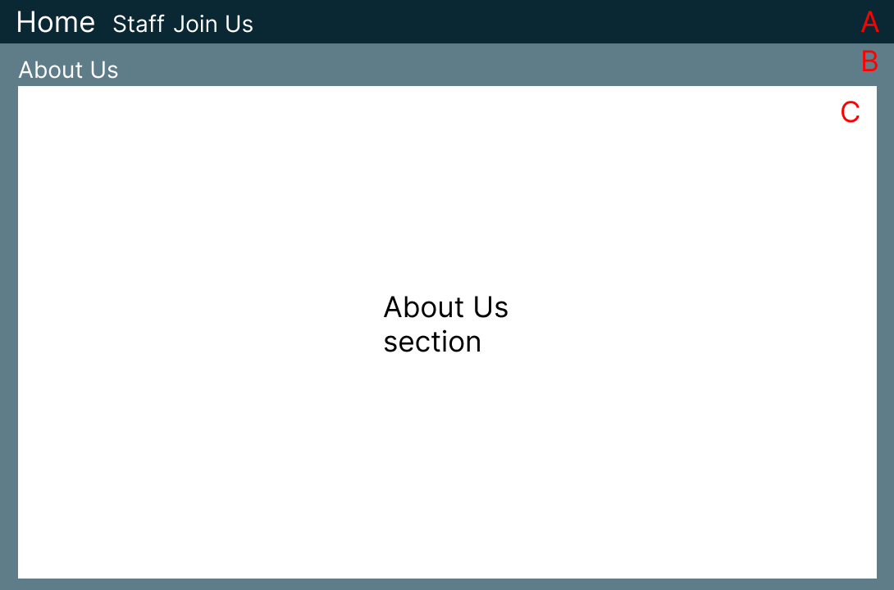

### Company Profile Design

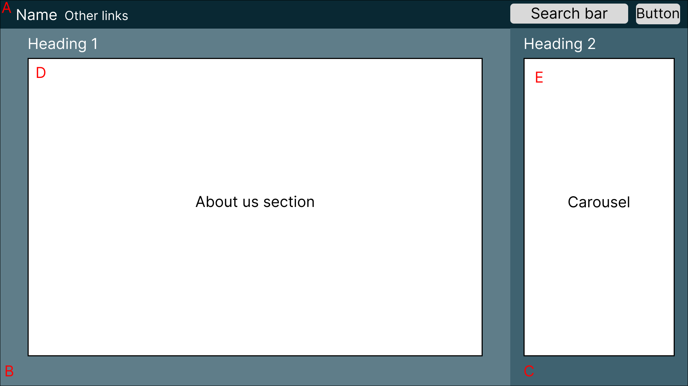

#### A Bootstrap Navbar

+ #092833
+ White text, weight 700
+ Width 100% Height 56 pixels
+ Will have the companies name, links to other pages and a search bar and button
+ Bootstraps navbar automatically adjusts its size and layout for smaller screens

#### B Bootstrap grid column

+ #5F7D89
+ Bootstrap padding 2, no margins
+ heading 1 tags are #ffffff, and use default weights and sizes.
+ Size: At and above the bootstrap breakpoint xl it is 8 of 12 columns in width, when it goes below xl it is 12 columns in width. Height 100%.

#### C Bootstrap grid column

+ #3F6270
+ Bootstrap padding 2, no margins
+ white text, heading 1 use default weights and sizes.
+ Size: At and above the bootstrap breakpoint xl it is 4 of 12 columns in width, when it goes below xl it is 12 columns in width. Height 100%.

#### D Text

+ white text, default heading weights and sizes. Paragraphs and list items text changes size depending on screen size, if the screen is 1200px of below the text is 14px, if it is above that it is 17px.

#### E Carousel with card

+ #3F6270 background colour and card colour.
+ default bootstrap card sizes
+ white text, default heading weights and sizes. Paragraphs and list items text changes size depending on screen size, if the screen is 1200px of below the text is 14px, if it is above that it is 17px.

All text will be in the Arial font and should it not be available then Helvetica, or sans-serif fonts.

I decided to go with design two for my website because for the first design I would have had to create a separate page for the staff according to client requirements. I also like this design because the added navigation capabilities like the search bar, which makes the site easier to navigate.

### Selected Company Profile Mobile

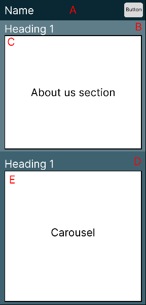

### Join us/Job Spec Page First Design

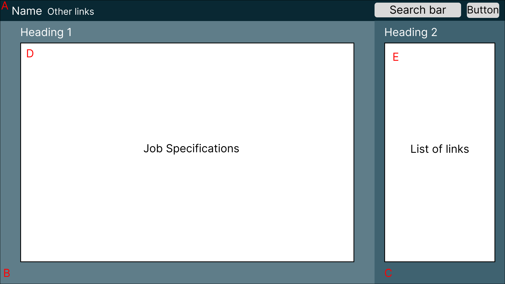

### Join us/Job Spec Page Alternative Design

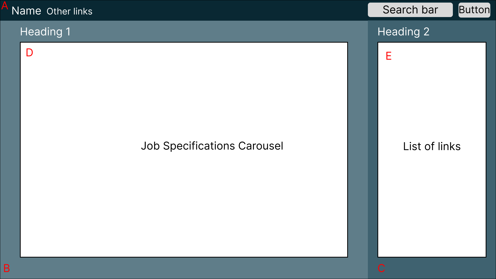

I decided to go with this design because I changed the job specification section to a carousel because otherwise there would need to be multiple different pages if there were more then one job available, this helps the code be more maintainable by reducing the amount of code. This design also makes the website easier to navigate because there will be less pages.

#### A Bootstrap Navbar

+ #092833
+ Width 100% Height 56 pixels
+ White text, weight 700
+ Will have the companies name, links to other pages and a search bar and button.
+ Bootstraps navbar automatically adjusts its size and layout for smaller screens.

#### B Bootstrap Grid column

+ #5F7D89
+ Bootstrap padding 2, no margins
+ heading 1 tags are #ffffff, and use default weights and sizes.
+ Size: At and above the bootstrap breakpoint xl it is 8 of 12 columns in width, when it goes below xl it is 12 columns in width. Height 100%.

#### C Bootstrap Grid column

+ #3F6270
+ Bootstrap padding 2, no margins
+ white text, heading 1 use default weights and sizes.
+ Size: At and above the bootstrap breakpoint xl it is 4 of 12 columns in width, when it goes below xl it is 12 columns in width. Height 100%.

#### D Bootstrap Carousel with card

+ #5F7D89 background colour
+ #ffffff Card colour
+ default bootstrap card sizes
+ black text, default heading weights and sizes. Paragraphs and list items text changes size depending on screen size, if the screen is 1200px of below the text is 14px, if it is above that it is 17px.

All text will be in the Arial font and should it not be available then Helvetica, or sans-serif fonts.

#### E Embedded YouTube video links

+ Three videos
+ height 30%, width 100%

### Join us/Job Spec Page Mobile Design

This is what it should look like for smaller screen sizes.

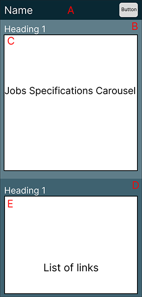

### Application Form

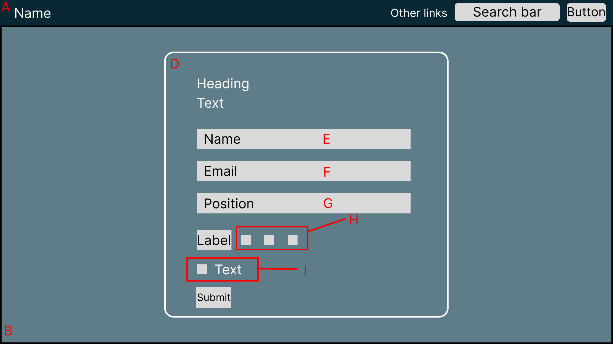

#### A Bootstrap navbar

+ #092833
+ White text, weight 700
+ Width 100% Height 56 pixels
+ Will have the companies name, links to other pages and a search bar and button.
+ Bootstraps navbar automatically adjusts its size and layout for smaller screens.

#### B Container

+ Width 100%, height 100%
+ #5F7D89

#### D Form

+ Border: 3px solid #ffffff
+ Padding: 40px
+ Border Radius: 10px
+ Min Width: 540px
+ Heading size 28px heading weight 600

#### E Input

Background Colour: #ffffff
Font Size: 15px
Font Weight: 300
Width: 100%, Height: auto

#### F Input

+ Background Colour: #ffffff
+ Font Size: 15px
+ Font Weight: 300
+ Width: 100%, Height: auto

#### G Select Box

+ Background Color: #ffffff
+ Font Size: 15px
+ Font Weight: 300

#### H Bootstrap Radio Buttons

+ Colour: #ffffff

#### I Confirmation Checkbox

+ Colour: #ffffff

#### Submit Button

+ Background Color: #6C757D
+ Hover Color: #495056

I chose this design because it keeps everything neat and modern. The input fields, select boxes, and radio buttons all have the same style, which makes them easy to use and looks good. Plus, the form is right in the middle of the page, so it looks balanced and works well on different-sized screens ensuring that it remains visually balanced and accessible across different screen sizes.

## Testing

### Functionality & Compatibility Testing

To test my website I will make sure all my links, buttons and interactive features work. To do this once I will go through and check all links, buttons and interactive features and record the results. To test the websites compatibility I will use it on multiple browsers and devices.

### Functionality & Compatibility Testing Results

### Company Profile Page

|   	          |Navigation links|Search Bar|Search Button|Carousel Previous button|Carousel Next button|
|-----------------|----------------|----------|-------------|------------------------|--------------------|
|Works as intended|&#10003;        |     X    |   X         |&#10003;                |     &#10003;       |

### Join Us Page

|   	          |Navigation links|Search Bar|Search Button|Carousel Next button|Video Links       | Apply Button     |
|-----------------|----------------|----------|-------------|--------------------|------------------|------------------|
|Works as intended|&#10003;        |     X    |   X         |&#10003;            |     &#10003;     |     &#10003;     |

### Form Page

|   	          |Navigation links|Search Bar|Search Button|Name Input          |Email Input       |Position selection|Radio Buttons     |CheckBox          |Submit            |
|-----------------|----------------|----------|-------------|--------------------|------------------|------------------|------------------|------------------|------------------|
|Works as intended|&#10003;        |     X    |   X         |&#10003;            |     &#10003;     |     &#10003;     |     &#10003;     |     &#10003;     |     &#10003;     |

### Form Validation

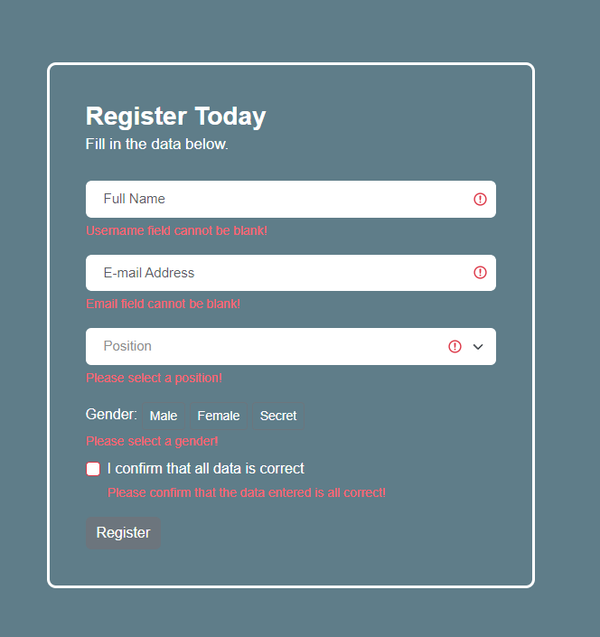

The fields cant be blank.

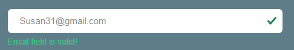

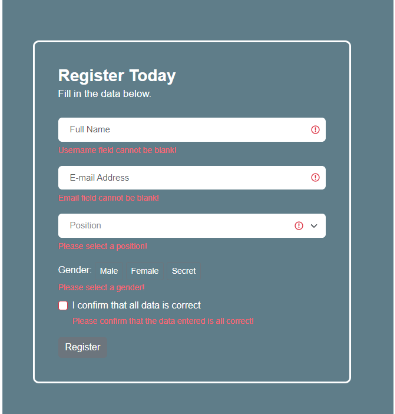

Email Input must be an email to be valid.

## Browser test

### Chrome

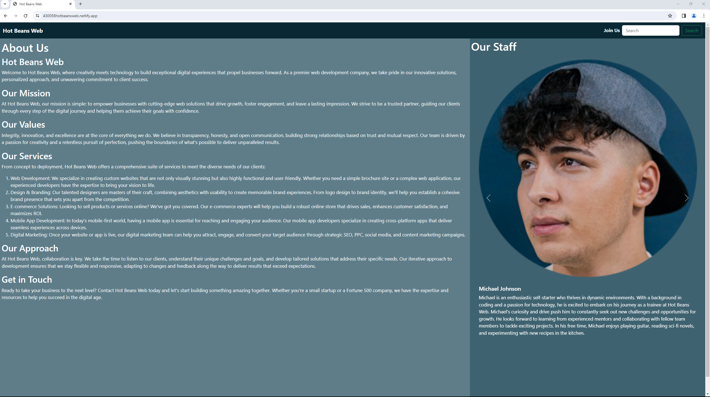

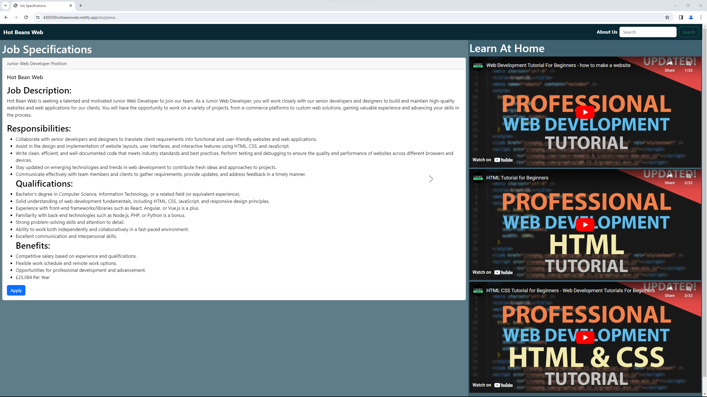

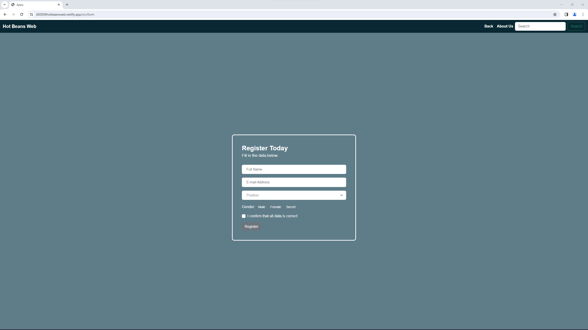

The website works as expected on chrome.

### Microsoft Edge

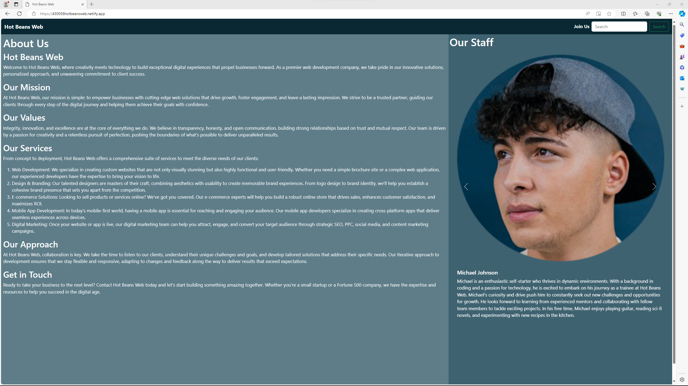

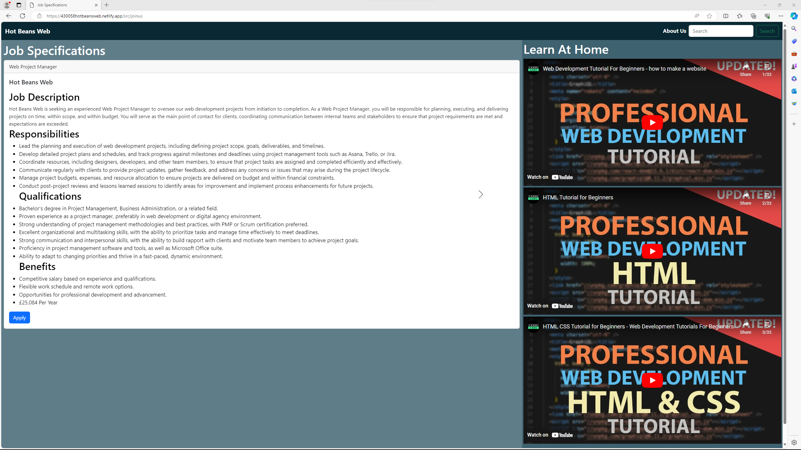

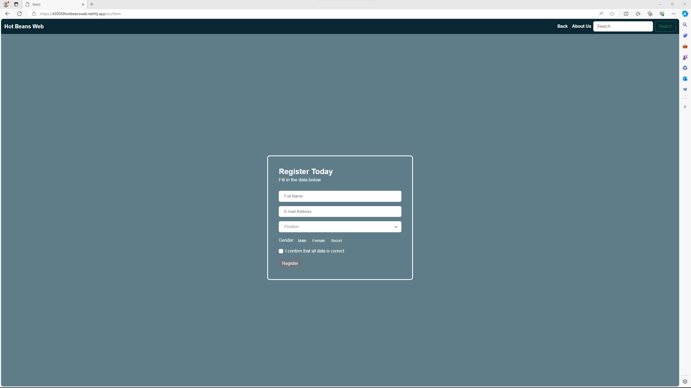

The website works as expected on Microsoft Edge.

## Device

## Phone

## Desktop Computer

### Usability Testing

To test this I let peers look at the website to provide feedback.

#### Mitchell Aldrich

"The overall layout and design of the website is great and seems very professional and organized. However, one improvement I picked out is to edit the headers of the different positions in the job specifications to make them more noticeable since at first I didn't notice they were there".

#### Ugnius Meildazys

"The websites color scheme is nice and easy on the eyes but there is a few problems, first the carousel of the current staff seem to break when you use it for the first time after that it fixes itself. The job specification page works fine but there is a few things that would bug people, first would be the ability to only go forward and not back on the different jobs and one of the three job specifications is a different size and it messes with the size of the page making it jump, second would be the videos there is three of the same videos maybe have 3 different ones instead of all of them the same. The apply page has no place to upload a cv or any file and the gender select is hard to see when you hover your mouse over it."

## Optimisations

### Before

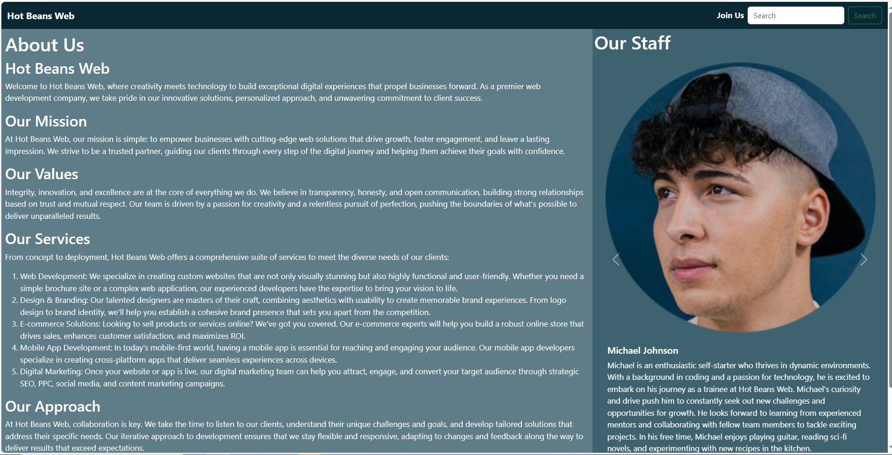

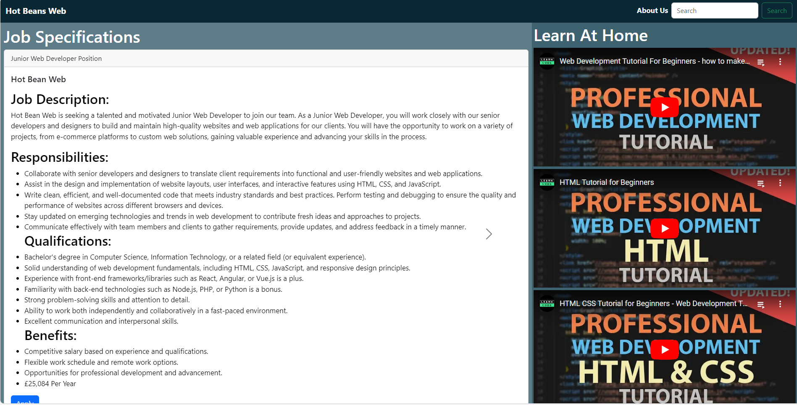

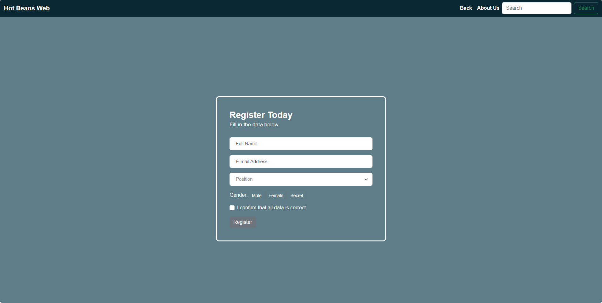

### After

## Evaluation

## References

<https://colorlib.com/wp/website-color-statistics/> - colour statistics
<https://marketsplash.com/color-psychology-statistics/#link4> - colour statistics
