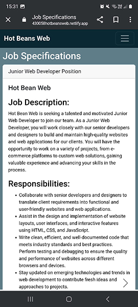

# Unit 15

[[toc]]

## Assignment 2

## Website

[Hot Beans Web](https://430058hotbeansweb.netlify.app/)

## File Structure

## To-Do List

+ Create Client Requirements 01/02/2024
+ Create storyboards 02/02/2024-05/02/2024
+ Create website 06/02/2024-12/02/2024
+ Usability testing 13/02/2024
+ Functionality Testing 13/02/24
+ Respond to testing 13/02/16--16/02/24
+ Optimisations  17/02/2024
+ Evaluation 18/02/24
+ Check through 19/02/24 - 28/02/2024
+ Deadline 28/02/2024

## Requirements

### Client Requirements

+ Have a company profile
+ Have profiles of existing trainee web developers
+ Job specifications and required qualifications
+ An online application form
+ Have links to web development courses

### User Requirements

+ A website that is accessible
+ A website that is easy to use and understand
+ A website that is easy to navigate
+ A website that is responsive
+ A website that loads within a couple of seconds

### Developer requirements

+ Code needs to be easy to understand
+ Code needs to be easy to maintain

### Target Audience

People who have completed training courses or qualifications related to web development and are now looking for a job as a web developer.

## Storyboards

### Company Profile Alternative Design

### Company Profile Design

#### A Bootstrap Navbar

+ #092833
+ White text, weight 700
+ Width 100% Height 56 pixels
+ Will have the company name, links to other pages and a search bar and button
+ Bootstraps navbar automatically adjusts its size and layout for smaller screens

#### B Bootstrap grid column

+ #5F7D89
+ Bootstrap padding 2, no margins
+ heading 1 tags are #ffffff, and use default weights and sizes.
+ Size: At and above the bootstrap breakpoint xl it is 8 of 12 columns in width, when it goes below xl it is 12 columns in width. Height 100%.

#### C Bootstrap grid column

+ #3F6270
+ Bootstrap padding 2, no margins
+ white text, heading 1 use default weights and sizes.
+ Size: At and above the bootstrap breakpoint xl it is 4 of 12 columns in width, when it goes below xl it is 12 columns in width. Height 100%.

#### D Text

+ white text, default heading weights and sizes. Paragraphs and list items text changes size depending on screen size, if the screen is 1200px or below the text is 14px, if it is above that it is 17px.

#### E Carousel with card

+ #3F6270 background colour and card colour.
+ default bootstrap card sizes
+ white text, default heading weights and sizes. Paragraphs and list items text changes size depending on screen size, if the screen is 1200px or below the text is 14px, if it is above that it is 17px.

All text will be in the Arial font and should it not be available then Helvetica, or sans-serif fonts.

I decided to go with design two for my website because for the first design, I would have had to create a separate page for the staff according to client requirements. I also like this design because of the added navigation capabilities like the search bar, which makes the site easier to navigate.

### Selected Company Profile Mobile

### Join us/Job Spec Page First Design

### Join us/Job Spec Page Alternative Design

I decided to go with this design because I changed the job specification section to a carousel because otherwise there would need to be multiple different pages if there were more than one job available, this helps the code be more maintainable by reducing the amount of code. This design also makes the website easier to navigate because there will be fewer pages.

#### A Bootstrap Navbar

+ #092833
+ Width 100% Height 56 pixels
+ White text, weight 700
+ Will have the company's name, links to other pages and a search bar and button.
+ Bootstraps navbar automatically adjusts its size and layout for smaller screens.

#### B Bootstrap Grid column

+ #5F7D89
+ Bootstrap padding 2, no margins
+ heading 1 tags are #ffffff, and use default weights and sizes.
+ Size: At and above the bootstrap breakpoint xl it is 8 of 12 columns in width, when it goes below xl it is 12 columns in width. Height 100%.

#### C Bootstrap Grid column

+ #3F6270
+ Bootstrap padding 2, no margins
+ white text, heading 1 use default weights and sizes.
+ Size: At and above the bootstrap breakpoint xl it is 4 of 12 columns in width, when it goes below xl it is 12 columns in width. Height 100%.

#### D Bootstrap Carousel with card

+ #5F7D89 background colour
+ #ffffff Card colour
+ default bootstrap card sizes
+ black text, default heading weights and sizes. Paragraphs and list items text changes size depending on screen size, if the screen is 1200px or below the text is 14px, if it is above that it is 17px.

All text will be in the Arial font and should it not be available then Helvetica, or sans-serif fonts.

#### E Embedded YouTube video links

+ Three videos
+ height 30%, width 100%

### Join us/Job Spec Page Mobile Design

This is what it should look like for smaller screen sizes.

### Application Form

#### A Bootstrap navbar

+ #092833
+ White text, weight 700
+ Width 100% Height 56 pixels
+ Will have the company's name, links to other pages and a search bar and button.
+ Bootstraps navbar automatically adjusts its size and layout for smaller screens.

#### B Container

+ Width 100%, height 100%
+ #5F7D89

#### D Form

+ Border: 3px solid #ffffff
+ Padding: 40px
+ Border Radius: 10px
+ Min Width: 540px
+ Heading size 28px heading weight 600

#### E Input

Background Colour: #ffffff
Font Size: 15px
Font Weight: 300
Width: 100%, Height: auto

#### F Input

+ Background Colour: #ffffff
+ Font Size: 15px
+ Font Weight: 300
+ Width: 100%, Height: auto

#### G Select Box

+ Background Color: #ffffff
+ Font Size: 15px
+ Font Weight: 300

#### H Bootstrap Radio Buttons

+ Colour: #ffffff

#### I Confirmation Checkbox

+ Colour: #ffffff

#### Submit Button

+ Background Color: #6C757D
+ Hover Color: #495056

I chose this design because it keeps everything neat and modern. The input fields, select boxes, and radio buttons all have the same style, which makes them easy to use and looks good. Plus, the form is right in the middle of the page, so it looks balanced and works well on different-sized screens ensuring that it remains visually balanced and accessible across different screen sizes.

## Justify design decisions

I believe my designs help meet the requirements.

One way they achieve this is with their layout. All the storyboards have a similar layout to ensure consistency, which creates a smoother and more intuitive experience for users. It is simple, with a navigation bar at the top and two sections for content. The only page that does not have this layout is the form page because it does not need it. This provides users with a website that is easy to understand, use, and navigate. The layouts are also responsive, which makes the sites much more accessible to users on other devices like mobile.

The designs make use of Bootstrap components such as carousels and cards, which helps minimize the number of pages needed as per the client's requirements. By leveraging these components, I combined the company profile page with the employee profile pages. This not only reduces the overall amount of code but also enhances maintainability for developers.

Another way the designs help meet requirements is with the selected typography and colour scheme.

### Colour Scheme

[Paletton](https://paletton.com/#uid=13q0u0kh5hca9roeDmlmgeJriag)

+ #2A4A56
+ #5F7D89
+ #3F6270
+ #193C4A
+ #092833

This colour scheme provides good contrast against light backgrounds, making text and interactive elements easily readable for users with visual impairments, and it is visually distinct, helping users easily distinguish different sections or elements on the website. Overall the selected colour scheme helps meet the accessibility requirements and makes the website easier to use and understand.

Testing the colour scheme using a [contrast checker](https://www.siegemedia.com/contrast-ratio#white-on-%233F6270).

### Typography

The fonts I have selected for the website is Arial because it was designed for readability, making it accessible to a wide range of audiences, including those with visual impairments. It is also a web-safe font, meaning it is commonly pre-installed on most computers and devices. In summary, the chosen typography aids in meeting accessibility requirements and enhances the website's usability and clarity. If the arial font is not available I have selected fall backs with the same benefits to arial. Helvetica is my second fall back since it is also easy to read, versatile, and web-safe. If that is not available then I'll go with sans-serif, since it has the same benefits as Arial and Helvetica.

## Testing

### Functionality & Compatibility Testing

To test my website I will make sure all my links, buttons and interactive features work. To do this I will go through and check all links, buttons and interactive features and record the results. To test the website's compatibility I will use it on multiple browsers and devices.

### Functionality & Compatibility Testing Results

### Company Profile Page

|                 |Navigation links|Search Bar|Search Button|Carousel Previous button|Carousel Next button|
|-----------------|----------------|----------|-------------|------------------------|--------------------|
|Works as intended|&#10003;        |     X    |   X         |&#10003;                |     &#10003;       |

### Join Us Page

|                 |Navigation links|Search Bar|Search Button|Carousel Next button|Video Links       | Apply Button     |
|-----------------|----------------|----------|-------------|--------------------|------------------|------------------|
|Works as intended|&#10003;        |     X    |   X         |&#10003;            |     &#10003;     |     &#10003;     |

### Form Page

|                 |Navigation links|Search Bar|Search Button|Name Input          |Email Input       |Position selection|Radio Buttons     |CheckBox          |Submit            |
|-----------------|----------------|----------|-------------|--------------------|------------------|------------------|------------------|------------------|------------------|
|Works as intended|&#10003;        |     X    |   X         |&#10003;            |     &#10003;     |     &#10003;     |     &#10003;     |     &#10003;     |     &#10003;     |

### Performance test

Using [Lighthouse](https://lighthouse-metrics.com/lighthouse/checks/e604eb23-a3d9-49e4-b0bf-a3487d2613ed) we can see that the website loads within a few seconds meeting client requirements.

### Form Validation

The fields can't be blank.

Email Input must be an email to be valid.

## Browser test

### Chrome

The website works as expected on Chrome.

### Microsoft Edge

The website works as expected on Microsoft Edge.

## Device

## Phone

### Company Profile Page

|                 |Navigation links|Search Bar|Search Button|Carousel Previous button|Carousel Next button|
|-----------------|----------------|----------|-------------|------------------------|--------------------|
|Works as intended|&#10003;        |     X    |   X         |&#10003;                |     &#10003;       |

### Join Us Page

|                 |Navigation links|Search Bar|Search Button|Carousel Next button|Video Links       | Apply Button     |
|-----------------|----------------|----------|-------------|--------------------|------------------|------------------|
|Works as intended|&#10003;        |     X    |   X         |&#10003;            |     &#10003;     |     &#10003;     |

### Form Page

|                 |Navigation links|Search Bar|Search Button|Name Input          |Email Input       |Position selection|Radio Buttons     |CheckBox          |Submit            |
|-----------------|----------------|----------|-------------|--------------------|------------------|------------------|------------------|------------------|------------------|
|Works as intended|&#10003;        |     X    |   X         |&#10003;            |     &#10003;     |     &#10003;     |     &#10003;     |     &#10003;     |     &#10003;     |

  

## Desktop Computer

[Here](#functionality--compatibility-testing-results)

### Usability Testing

To test this I let peers look at the website to provide feedback.

#### Mitchell Aldrich

"The overall layout and design of the website is great and seems very professional and organized. However, one improvement I picked out is to edit the headers of the different positions in the job specifications to make them more noticeable since at first I didn't notice they were there".

#### Nojus Timofejevas

"The Navbar looks really clean and professional, and I love how they've used a carousel for extra info without it being distracting. But, when you're trying to apply, there's no place to upload your CV or any other files. Also, it's kind of hard to see the gender selection and submit buttons when you hover over them."

#### Respond to feedback

Mitchell provided feedback indicating that the job positions were not easily discernible, which contradicts the requirements set by my client. To address this issue, I enclosed the job positions with an h1 tag and applied black styling to enhance their visibility.

Nojus has said that there is no place to upload your cv to the website. In response to this I have added a place to upload files to the form using Bootstrap. I also agree that the gender selection and submit buttons are hard to see so in response I have changed their colours to #092833 and #193C4A.

## Optimisations

### Before

### After

## Write an evaluation of the design, development, and optimisation of the web site

### Design

I believe my websites design meets the requirements, and effectively appeals to the target audience and meets its stated purpose.

One way it does this is with the chosen color scheme, which provides excellent contrast against light backgrounds, which was proven with [testing](#colour-scheme), ensuring that text and interactive elements remain easily readable for users, including those with visual impairments.

Secondly, the typography selected not only meets accessibility requirements but also significantly enhances the website's usability and clarity. Throughout the site, clear and legible fonts are used and ensure effortless reading across diverse devices and screen sizes. This enhances user experience, makes navigation intuitive for all visitors.

Furthermore, the website's layout is intuitive and user-friendly, allowing visitors to navigate seamlessly between pages with ease. Consistent navigation elements, such as navigation bars and links, guide users through the site and encourage interaction.

Additionally, the page performs well. Testing the website using [lighthouse-metrics](https://lighthouse-metrics.com/lighthouse/checks/e604eb23-a3d9-49e4-b0bf-a3487d2613ed), we can see that the page's [First Contentful Paint, Speed Index, Largest Contentful Paint, Total Blocking Time, and Cumulative Layout Shift](#performance-test) all meet the requirements.

Finally, the responsive design ensures accessibility on a range of devices, providing a consistent and optimized experience for users regardless of whether they are accessing the website on a desktop computer, tablet, or mobile phone. This adaptability not only caters to the diverse preferences of the target audience but also reinforces the website's usability and accessibility, enhancing overall user satisfaction and engagement.

### Development

### Optimisation

### My Performance